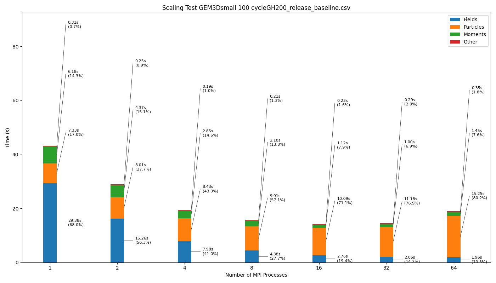
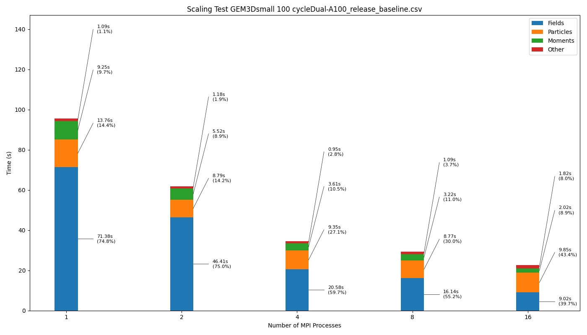

# iPIC3D-CUDA

> iPIC3D with CUDA acceleration, supporting multi-node multi-GPU.
```                                                                       
          ,-.----.                           .--,-``-.                   
          \    /  \      ,---,   ,----..    /   /     '.       ,---,     
  ,--,    |   :    \  ,`--.' |  /   /   \  / ../        ;    .'  .' `\   
,--.'|    |   |  .\ : |   :  : |   :     : \ ``\  .`-    ' ,---.'     \  
|  |,     .   :  |: | :   |  ' .   |  ;. /  \___\/   \   : |   |  .`\  | 
`--'_     |   |   \ : |   :  | .   ; /--`        \   :   | :   : |  '  | 
,' ,'|    |   : .   / '   '  ; ;   | ;           /  /   /  |   ' '  ;  : 
'  | |    ;   | |`-'  |   |  | |   : |           \  \   \  '   | ;  .  | 
|  | :    |   | ;     '   :  ; .   | '___    ___ /   :   | |   | :  |  ' 
'  : |__  :   ' |     |   |  ' '   ; : .'|  /   /\   /   : '   : | /  ;  
|  | '.'| :   : :     '   :  | '   | '/  : / ,,/  ',-    . |   | '` ,/   
;  :    ; |   | :     ;   |.'  |   :    /  \ ''\        ;  ;   :  .'     
|  ,   /  `---'.|     '---'     \   \ .'    \   \     .'   |   ,.'       
 ---`-'     `---`                `---`       `--`-,,-'     '---'         
                                                                         
```

## Citation
Markidis, Stefano, and Giovanni Lapenta. "Multi-scale simulations of plasma with iPIC3D." Mathematics and Computers in Simulation 80.7 (2010): 1509-1519.

## Usage

### Requirement
To install and run iPIC3D-CUDA, you need: 
- CUDA compatible hardware, CUDA capabiliy 7.5 or higher 
- cmake, MPI(MPICH and OpenMPI are tested) and HDF5 (optional), C/C++ compiler supporting C++ 17 standard

**To meet the requirements of compatability between CUDA and compiler, it's recommended to use a relatively new compiler version e.g. GCC 12**

If you are on a super-computer or cluster, it's highly possible that you can use tools like `module` to change the compiler, MPI or libraries used.

### Get the code

Git clone this repository or download the zip file of default branch. For example:

``` shell
git clone https://github.com/iPIC3D/iPIC3D-GPU.git iPIC3D-GPU
cd ./iPIC3D-GPU
```
Now you are in the project folder

### Build

- Create a build directory
``` shell
mkdir build && cd build
```
- Use `CMake` to generate the make files
``` shell
# use .. here because CMakeList.txt would be under project root 
cmake ..
```


- Compile with `make` if successful, you will find an executable named `iPIC3D` in build directory
``` shell
make # you can use this single-threaded compile command, but slow
make -j4 # build with 4 threads
make -j # build with max threads, fast, recommended
```

### Run

iPIC3D uses inputfiles to control the simulation, we pass this text file as the only command line argument:

``` shell
mpirun -np 16 ./iPIC3D ../inputfiles/testGEM2Dreal.inp
```

With this command, you are using 16 MPI processes with the setup `../inputfiles/testGEM2Dreal.inp`.

**Important:** make sure `number of MPI process = XLEN x YLEN x ZLEN` as specified in the input file.

If you are on a super-computer, especially a multi-node system, it's likely that you should use `srun` to launch the program. 

#### Multi-node and Multi-GPU

Assigning MPI processes to nodes and GPUs are vital in performance, for it decides the pipeline and subdomains in the program.

It's recommended to use more than 1 MPI process per GPU. The following example uses 4 nodes, each equipped with 4 GPU:

``` shell
# 1 MPI process per GPU
srun --nodes=4 --ntasks=16 --ntasks-per-node=4 ./iPIC3D ../benchmark/GEM3Dsmall_4x2x2_100/testGEM3Dsmall.inp 

# 2 MPI processes per GPU
srun --nodes=4 --ntasks=32 --ntasks-per-node=8 ./iPIC3D ../benchmark/GEM3Dsmall_4x4x2_100/testGEM3Dsmall.inp  
```


### Result

This iPIC3D-CUDA will create folder (usually named `data`) for the output results if it doesn't exist. However, **it will delete everything in the folder if it already exits**.


## Build Options

### Debug

By default, the software is built with `Release` build type, which means highly optimized by the compiler. If you'd like to debug, use:

``` shell
cmake -DCMAKE_BUILD_TYPE=Debug ..
```
instead, and you'll have `iPIC3D_d`. If you'd like to just have an unoptimized (slow) version:
``` shell
cmake -DCMAKE_BUILD_TYPE=Default ..
```

### OpenMP

In this iPIC3D-CUDA, the Solver stays on the CPU side, which means the number of MPI process will not only affect the GPU but also the Solver's performance. 

To speedup the CPU part, you can enable OpenMP with:
``` shell
cmake -DUSE_OPENMP=ON ..
# set OpenMP threads for each MPI process
export OMP_NUM_THREADS=4
```
However, current program won't be benefited from OpenMP.

## Tool

### Benchmark
In [benchmark](./benchmark/) folder, we prepared some scripts for profiling, please read the [benchmark/readme](./benchmark/readme.md) for more infomation.

What's more, there're two performance baseline files for your reference:





You can find the corresponding data at [./benchmark/GH200_release_baseline.csv](./benchmark/GH200_release_baseline.csv) and [./benchmark/Dual-A100_release_baseline.csv](./benchmark/Dual-A100_release_baseline.csv). 

Please note that the `Particle` and `Moments` parts are not exactly the time consumption of these two parts, as the kernels are interwaved in this version. The sum of the two parts are precise, though.

### CUDA-Compatible Docker Image

Please refer to [Dockerfile](./Dockerfile).

## Contact

Feel free to contact Professor Stefano Markidis at KTH for using iPIC3D. 


